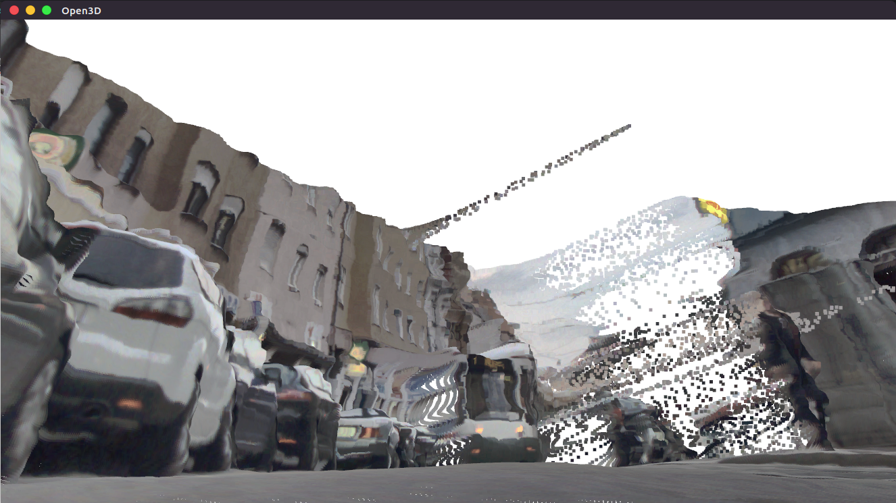

## Inverse Projection

> **_Inputs: RGB + depth map_**  
> **_Output: colored 3D point_**

Ref: https://github.com/darylclimb/cvml_project/blob/master/projections/inverse_projection/inverse_project.py


Test on Ubuntu 16.04, open3d 0.7.0

```bash
pip install open3d-python

python inverse.py
```


